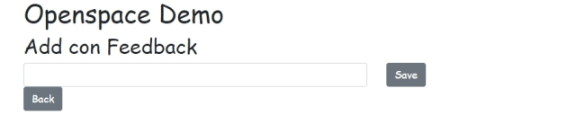
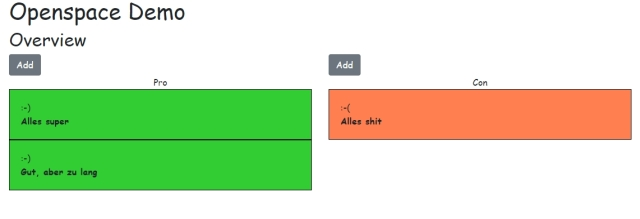

# Feedback Demo Application

## Getting started

```bash
yarn
yarn start

# or

npm install
npm start

# browse http://localhost:3000
```

## What to expect

Expect not too much. The app has been hacked (incl. some explanations) within 45 Minutes and thats it.

## Screenshots




## Part that where demonstrated

- [React](https://reactjs.org/)
- [Typescript](https://www.typescriptlang.org/)
- [Redux](https://redux.js.org/)

## Furthermore the following libraries are used

- [react-redux](https://redux.js.org/)
- [typscript with redux](https://redux.js.org/recipes/usage-with-typescript)
- [redux-toolkit](https://redux-toolkit.js.org/)
- [reactstrap](https://reactstrap.github.io/)
- [styled-components](https://styled-components.com/)
- [reach-router](https://reach.tech/router/)

## Hints

The app has been bootstrapped with [npx create-react-app](docs/README_CRA.md).
